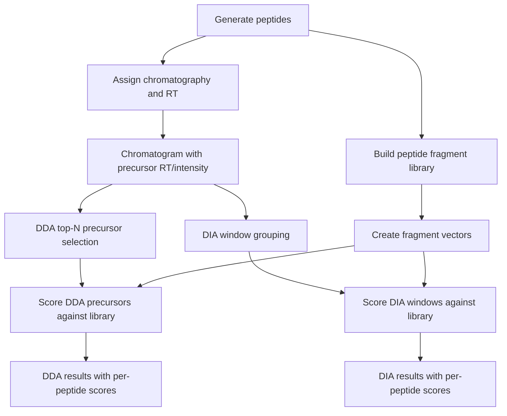
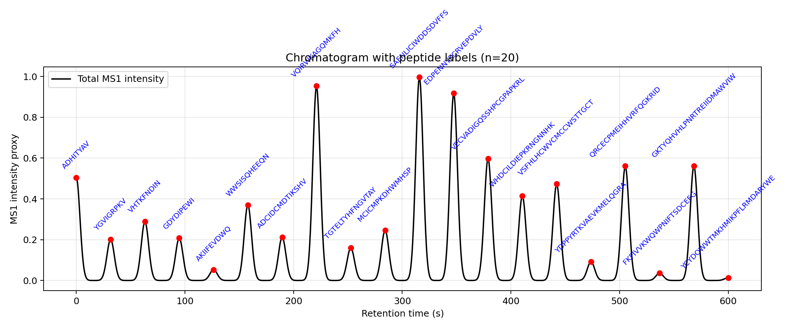

# proteomics_sim
The package provides the proteomics LC-MS/MS acquisition (DDA/DIA) quantification simulation framework on which those components can be added for exploring the transition between Data-Dependent Acquisition (DDA) and narrow-window Data-Independent Acquisition (nDIA) in modern proteomics. The goal of this project is to provide a transparent, modifiable, and educational environment for studying how acquisition strategy, chromatography, fragmentation, and quantification interact in shotgun proteomics experiments.

Repository:

[proteomics_sim GitHub Repository](https://github.com/animesh/proteomics_sim)



---
### example.py

Minimal example script.

Prints generated peptides, MS1 peptide metrics, DDA selections, and DIA window peptide assignments with MS2 proxy and scoring.

Example command:

```bash
python -m py_compile example.py
python example.py --n_peptides 200 --gradient_min 10 --window 2 --topn 1
```

Optional plot output:

```bash
python example.py --n_peptides 20 --gradient_min 10 --window 2 --topn 1 --plot
```

This creates a plot from the same `example.py` run with current peptide `mz`, `rt`, and abundance values.



The generated plot filename includes the run arguments, for example:

```text
plots/example_n20_g10p0_w2p0_topn1_chromatogram.png
```

This run generated 200 peptides, assigned linear retention times by precursor m/z, and assigned each peptide a random MS1 abundance uniformly drawn from [0, 1]. It selected top-1 DDA precursors per scan using a chromatographic intensity model, and grouped DIA precursors into 2 Th windows using precursor m/z.

Important detail:
* DDA is time-aware: it evaluates peptide intensity at each scan time using the peptide RT and abundance.
* DIA currently ignores retention time and only bins precursors by m/z window.
* DIA still carries MS1 abundance as the peptide's assigned `abundance` value from `assign_chromatography()`.
* MS2 abundance is a proxy derived from MS1 abundance divided by number of fragments; the window-level total sums peptide MS1 abundances when multiple peptides fall in the same DIA window.
* `scores` are computed in `simulator.py` with `scoring.score_against_library(...)`, and are attached to each selected DDA peptide and each peptide in every DIA window.
* DIA scoring uses a combined window-level fragment spectrum. For windows with multiple precursors, the same `scores` dictionary is shared across all peptides in that window, so the output is now reported as a window-level `top_matches` summary instead of a repeated per-peptide `top_match`.

Validation:
* Compiled `example.py` using `python -m py_compile example.py` to ensure the script is syntactically valid.
* Executed the script with `python example.py --n_peptides 200 --gradient_min 10 --window 2 --topn 1`.
* Confirmed output contains DIA windows with 2 peptides and window-level best matches, e.g.:

```text
window 996.0 - 998.0: 2 peptides
  window top_matches: AHLHFKLM (0.7071), RVHQEILC (0.7071)
```

DIA cofragmentation example:
* `python -m py_compile example.py`
* `python example.py --n_peptides 200 --gradient_min 10 --window 2 --topn 1`
* The output shows DIA windows with multiple precursors and a shared window-level score summary.

This demonstrates the corrected behavior: when a DIA window contains multiple precursors, the output shows the top one or two library matches for the combined window spectrum, rather than repeating the same match for each precursor.

DDA coelution note:
* DDA uses a time-aware Gaussian intensity model and selects only the top `topn` precursors per scan.
* With `topn=1`, a weaker peptide that coelutes within the same peak can be missed.
* Example validation command:

```bash
python -m py_compile example.py
python example.py --n_peptides 100 --gradient_min 10 --window 2 --topn 1
```

The updated `example.py` now prints a DDA coelution check after the DDA summary. When a close RT pair is found, it shows whether both peptides were selected.

Expected DDA coelution check output format:

```text
DDA coelution check:
  closest RT separation: 6.0606 seconds
  peptide1 selected: True id=36 seq=VCNIDCA rt=0.0000 abundance=0.9389
  peptide2 selected: False id=72 seq=TLRACSPQ rt=6.0606 abundance=0.0426
```

This shows that two peptides separated by about 6 seconds in RT can overlap enough for the weaker peptide to be missed when `topn=1`.

Sample output from the default run `python example.py`:

```text
Generated peptides:
(0, 'AKIIFEVDWQ', 1247, 1248.007)
(1, 'ADHITYAV', 888, 889.007)
(2, 'VQIRWKAGQMKFH', 1627, 1628.007)

MS1 summary:
  precursor count: 3
  total abundance: 2.0552
  mean abundance: 0.6851

MS1 peptides:
  id=0 seq=AKIIFEVDWQ mz=1248.0070 rt=30.0000 abundance=0.5491
  id=1 seq=ADHITYAV mz=889.0070 rt=0.0000 abundance=0.7505
  id=2 seq=VQIRWKAGQMKFH mz=1628.0070 rt=60.0000 abundance=0.7556

DDA selected peptides with MS2 proxy and scoring:
  id=1 seq=ADHITYAV mz=889.0070 rt=0.0000 abundance=0.7505 n_fragments=14 ms2_abundance=0.0536 top_match=ADHITYAV (1.0000)
    scores={0: 0.063, 1: 1.0, 2: 0.0546}
  id=0 seq=AKIIFEVDWQ mz=1248.0070 rt=30.0000 abundance=0.5491 n_fragments=18 ms2_abundance=0.0305 top_match=AKIIFEVDWQ (1.0000)
    scores={0: 1.0, 1: 0.063, 2: 0.0}
  id=2 seq=VQIRWKAGQMKFH mz=1628.0070 rt=60.0000 abundance=0.7556 n_fragments=24 ms2_abundance=0.0315 top_match=VQIRWKAGQMKFH (1.0000)
    scores={0: 0.0, 1: 0.0546, 2: 1.0}

DDA MS2 summary: 3 DDA spectra selected
  total MS1 abundance selected: 2.0552
  total MS2 abundance proxy: 2.0552
  mean MS2 abundance per fragment: 0.0385

DIA windows with MS2 proxy per window and scoring:
  window 888.0 - 890.0: 1 peptides
    window top_matches: ADHITYAV (1.0000)
    id=1 seq=ADHITYAV mz=889.0070 rt=0.0000 abundance=0.7505 n_fragments=14 ms2_abundance=0.0536
      scores={0: 0.063, 1: 1.0, 2: 0.0546}
  window 1248.0 - 1250.0: 1 peptides
    window top_matches: AKIIFEVDWQ (1.0000)
    id=0 seq=AKIIFEVDWQ mz=1248.0070 rt=30.0000 abundance=0.5491 n_fragments=18 ms2_abundance=0.0305
      scores={0: 1.0, 1: 0.063, 2: 0.0}
  window 1628.0 - 1630.0: 1 peptides
    window top_matches: VQIRWKAGQMKFH (1.0000)
    id=2 seq=VQIRWKAGQMKFH mz=1628.0070 rt=60.0000 abundance=0.7556 n_fragments=24 ms2_abundance=0.0315
      scores={0: 0.0, 1: 0.0546, 2: 1.0}

DIA MS2 summary: 3 DIA windows generated
  total MS2 abundance proxy across DIA peptides: 2.0554
```

Explanation of fields:
* `Generated peptides:` shows the initial peptide list as `(id, sequence, mass, mz)`.
* `MS1 summary:` reports the number of precursors, total MS1 abundance, and mean abundance.
* `MS1 peptides:` shows the retained `id`, `sequence`, `mz`, assigned retention time `rt`, and random MS1 `abundance`.
* In `DDA selected peptides...`, each selected peptide is scored against the library:
  * `n_fragments` is the number of fragment ions generated for that peptide.
  * `ms2_abundance` is a proxy equal to MS1 abundance divided by `n_fragments`.
  * `top_match` is the best-matching library peptide sequence plus its best cosine score.
  * `scores` is the per-library-peptide cosine similarity dictionary used for scoring.
* `DDA MS2 summary:` totals the selected MS1 abundance, proxy MS2 abundance, and mean per-fragment abundance.
* In `DIA windows...`, each window groups precursors by m/z:
  * `window low - high` shows the isolation window bounds.
  * `window top_matches` lists the top one or two library matches for the combined window spectrum.
  * Each peptide line shows the same peptide-level metadata as DDA, but `scores` are shared window-level scores.
* `DIA MS2 summary:` reports the number of windows and the total proxy MS2 abundance across all peptides. 

---

# Motivation

Recent advances in high-speed mass spectrometry, particularly Orbitrap Astral technology, have enabled DIA acquisition with extremely narrow precursor isolation windows (1.2-2 Th). These acquisition strategies produce increasingly DDA-like MS/MS spectra while retaining systematic precursor coverage.

This repository was created to investigate questions such as:

* How narrow must DIA windows become before DIA behaves similarly to DDA?
* How do MS1 and MS2 quantification differ?
* How does dynamic exclusion affect identification coverage?
* How do chromatographic peak widths influence quantitative precision?
* How does collision-energy optimization affect DDA and DIA differently?
* How do completeness, coefficient of variation (CV), and ratio accuracy change under different acquisition schemes?
* What aspects of DDA and DIA are fundamentally different and what aspects are converging?

---

# Scientific Background

This project is inspired by:

**Naomi O'Sullivan,  Florian P Bayer,  Carolin Mogler,  Bernhard Kuster.**

*High-Speed Mass Spectrometers diminish the difference between Data-Dependent and Data-Independent Acquisition Proteomics.*

The study demonstrated that ultra-fast DIA acquisition using narrow precursor windows can achieve comprehensive proteome coverage while reducing spectral complexity and increasing similarity to DDA spectra.

Relevant links:

* https://www.biorxiv.org/content/10.64898/2026.05.26.727836v1 (https://doi.org/10.64898/2026.05.26.727836)
* Data Availability section says that it should be there on PRIDE but i could not find it https://www.ebi.ac.uk/pride/archive?keyword=High-Speed%20Mass%20Spectrometers%20diminish%20the%20difference%20between%20Data%20Dependent%20and%20Data-Independent%20Acquisition%20Proteomics%20

The simulator attempts to reproduce the qualitative mechanisms discussed in the manuscript:

* DDA Top-N precursor selection
* Dynamic exclusion
* Narrow DIA windows
* Peptide-specific fragmentation efficiency
* Fixed versus adaptive collision energy
* Chromatographic variability
* Run-to-run variability
* MS1 quantification
* MS2 quantification
* Quantitative precision and completeness

The simulator is inspired by the paper but does not reproduce instrument firmware, Orbitrap Astral hardware behavior, DIA-NN processing, or identification algorithms used in the publication.

---

# Current Status

⚠️ Research prototype

Current implementation includes:

* random peptide sequence generation with fixed amino acid masses
* precursor m/z assignment and linear retention-time assignment from m/z to RT
* random MS1 abundance assignment for each peptide drawn uniformly from [0, 1]
* MS2 abundance proxy derived from MS1 abundance by dividing that value across the peptide's fragment ions
* chromatogram-aware DDA precursor selection using top-N per scan
* fixed-width DIA window precursor grouping (m/z only; RT is currently ignored for DIA binning)
* library-preserving fragment vector construction for every peptide
* DDA and DIA scoring against the full peptide fragment library
* structured output containing peptide records and per-peptide `scores` dictionaries

Current implementation does not include:

* realistic chromatographic peak modeling
* retention-time drift
* ionization variability
* true MS1/MS2 intensity modeling
* peptide identification
* FDR estimation
* DIA deconvolution
* protein inference
* isotope envelopes
* instrument physics

---

## Repository structure

```text
proteomics_sim/
|-- __init__.py
|-- check.py
|-- compare_windows.py
|-- chromatography.py
|-- dda.py
|-- dia.py
|-- digest.py
|-- example.py
|-- fragmentation.py
|-- ndia.py
|-- peptides.py
|-- quantification.py
|-- README.md
|-- run_paper_like_study.py
|-- scoring.py
|-- simulator.py
|-- test.py
\-- plots/
```

## Key modules

### peptides.py

Random peptide sequence generation.

Generates:

* peptide IDs
* amino acid sequences
* peptide mass
* approximate precursor m/z

---

### fragmentation.py

Fragment ion generation.

Generates basic b/y ion masses for a peptide sequence.

---

### dda.py

Data-dependent acquisition placeholder.

Performs a top-N precursor selection over the peptide list.

---

### dia.py

Data-independent acquisition placeholder.

Groups precursor records into fixed m/z windows. In the current implementation, DIA ignores peptide RT/time and does not model chromatographic coelution; it still carries per-precursor MS1 abundance in the peptide tuple.

---

### simulator.py

Simulation orchestration.

Runs peptide generation, MS1 chromatography assignment, DDA selection, DIA binning, fragment library construction, and scoring.

MS1 abundance is assigned randomly per peptide, and MS2 abundance is derived from the peptide abundance divided by the number of fragments.

Returns a dictionary containing:

* `peptides`
* `chromatogram`
* `ms1`
* `dda`
* `dia`
* `ms2`
* `library`

---

### compare_windows.py

A small DIA window width sweep helper.

Runs the simulator for a set of window widths and reports per-window precursor counts.

---


### scoring.py

Small scoring utility module.

Provides a dot-product helper function used to score DDA peptides and DIA window fragment collections against the generated fragment library.

---

## Installation

Clone the repository:

```bash
git clone https://github.com/animesh/proteomics_sim.git
cd proteomics_sim
```

Optional virtual environment:

```bash
python -m venv venv
source venv/bin/activate
```

Windows:

```powershell
venv\Scripts\activate
```

Install optional dependencies:

```bash
pip install numpy pandas
```

The core simulator requires `numpy`, while some legacy helper scripts still rely on `pandas`.

---

## Usage

Run the current example:

```powershell
cd \Download\proteomics_sim
python example.py
```

Run the simulator directly:

```powershell
cd \Download\proteomics_sim
python -c "from simulator import Simulator; r=Simulator().run(100, 20); print(r['dda']); print(len(r['dia']))"
```

The current `__init__.py` export provides `Simulator`, so importing from `simulator` directly remains the recommended path.

---

## Output structure

`Simulator().run()` returns a dictionary with:

* `peptides` — generated peptide tuples
* `chromatogram` — shared chromatogram input used by both DDA and DIA
* `dda` — selected precursor list with per-peptide DDA scores
* `dia` — DIA window bins with per-peptide DIA window scores
* `library` — fragment masses per peptide

---

## Notes

This repository is a minimal or toy prototype intended for conceptual exploration. It is not a production-grade proteomics engine.

---

# Scientific Caveats

This repository is a mechanistic simulator. Major simplifications include:

* simplified Gaussian peak intensity model used for DDA scan scoring
* simplified fragmentation
* no isotope distributions
* no detector physics
* no identification engine
* no FDR estimation
* no protein grouping

---

# Contributing

Contributions are welcome.

Areas of particular interest:

* realistic fragmentation models
* phosphoproteomics support
* DIA deconvolution
* protein inference
* benchmarking datasets
* visualization modules

---

