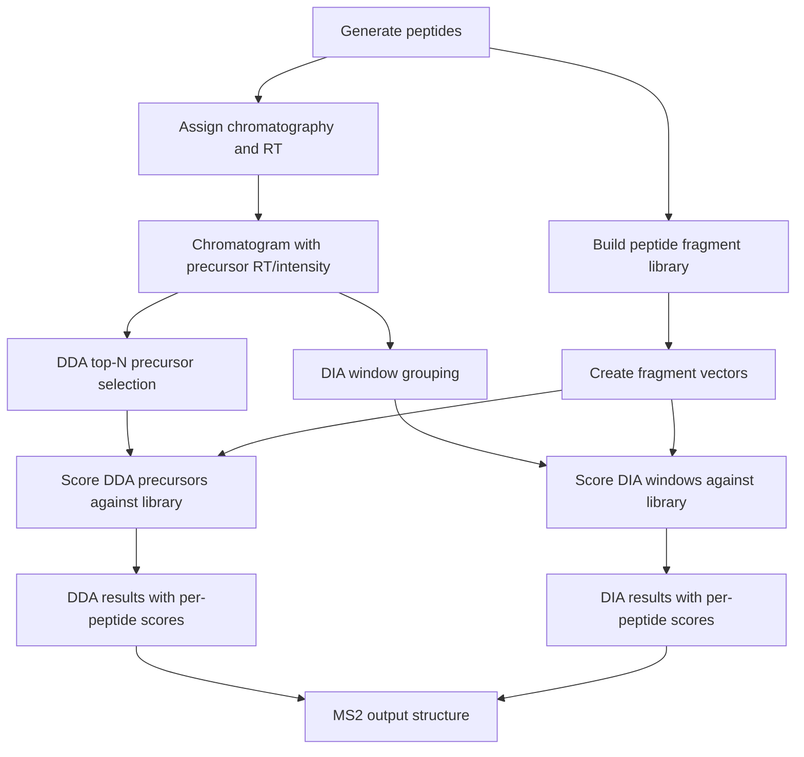

# proteomics_sim
The package provides the proteomics LC-MS/MS acquisition (DDA/DIA) quantification simulation framework on which those components can be added for exploring the transition between Data-Dependent Acquisition (DDA) and narrow-window Data-Independent Acquisition (nDIA) in modern proteomics. The goal of this project is to provide a transparent, modifiable, and educational environment for studying how acquisition strategy, chromatography, fragmentation, and quantification interact in shotgun proteomics experiments.

Repository:

[proteomics_sim GitHub Repository](https://github.com/animesh/proteomics_sim)



---
### example.py

Minimal example script.

`example.py` runs the current `Simulator` implementation and prints:

* generated peptides and their assigned RT/abundance
* MS1 summary statistics
* DDA-selected precursor details with MS2 proxy abundance and per-peptide library scores
* a DDA coelution check when a close RT peptide pair exists
* DIA window summaries with shared window-level top matches and peptide-level trace metadata

Example command:

```bash
python example.py --n_peptides 100 --gradient_min 10 --window 2 --topn 1
```

Optional plot output:

```bash
python example.py --n_peptides 20 --gradient_min 10 --window 2 --topn 1 --plot
```

This writes a PNG file under `plots/` showing the total MS1 chromatogram and labeled peptide apexes.

Important details:
* `chrom_assign.py` assigns RT by sorting peptides by precursor m/z and mapping them linearly across the gradient.
* MS1 abundance is assigned in `chrom_assign.py` using random log-uniform sampling between 1e3 and 1e7.
* `chromatography.py` defines the Gaussian peak model used by DDA and by the plot generator.
* `dda.py` evaluates peptide intensity at each scan time and selects the top `topn` precursors per scan.
* `dia.py` groups precursors into fixed m/z windows and returns one observation per peptide with an aggregated trace and integrated `chrom_area`.
* `Simulator.run()` computes `scores` with `scoring.score_against_library(...)` for both DDA-selected peptides and DIA window observations.
* In DIA output, window scoring is shared across peptides in the same window. `example.py` prints `window top_matches` from the shared window-level score dictionary.

Example validation command:

```bash
python example.py --n_peptides 100 --gradient_min 10 --window 2 --topn 1
```

The current implementation demonstrates both coelution and DIA cofragmentation behavior:
* DDA coelution is shown when two peptides elute within 8 seconds of one another and only the stronger precursor is selected under `topn=1`.
* DIA windows can contain multiple precursors; the output shows window-level `top_matches` and each peptide's `trace_points` and `chrom_area`.

Sample output from `example.py`:

```text
DDA selected peptides with MS2 proxy and scoring:
  id=1 seq=ADHITYAV mz=889.0070 rt=0.0000 abundance=0.7505 n_fragments=14 ms2_abundance=0.0536 top_match=ADHITYAV (1.0000)
    scores={0: 0.063, 1: 1.0, 2: 0.0546}

DIA windows with MS2 proxy per window and scoring:
  window 888.0 - 890.0: 1 precursor
    window top_matches: ADHITYAV (1.0000)
    id=1 seq=ADHITYAV mz=889.0070 rt=0.0000 abundance=0.7505 n_fragments=14 trace_points=50 chrom_area=12345.67 ms2_abundance=0.0536
      scores={0: 0.063, 1: 1.0, 2: 0.0546}
```

---

# Motivation

Recent advances in high-speed mass spectrometry, particularly Orbitrap Astral technology, have enabled DIA acquisition with extremely narrow precursor isolation windows (1.2-2 Th). These acquisition strategies produce increasingly DDA-like MS/MS spectra while retaining systematic precursor coverage.

This repository was created to investigate questions such as:

* How narrow must DIA windows become before DIA behaves similarly to DDA?
* How do MS1 and MS2 quantification differ?
* How does dynamic exclusion affect identification coverage?
* How do chromatographic peak widths influence quantitative precision?
* How does collision-energy optimization affect DDA and DIA differently?
* How do completeness, coefficient of variation (CV), and ratio accuracy change under different acquisition schemes?
* What aspects of DDA and DIA are fundamentally different and what aspects are converging?

---

# Scientific Background

This project is inspired by:

**Naomi O'Sullivan,  Florian P Bayer,  Carolin Mogler,  Bernhard Kuster.**

*High-Speed Mass Spectrometers diminish the difference between Data-Dependent and Data-Independent Acquisition Proteomics.*

The study demonstrated that ultra-fast DIA acquisition using narrow precursor windows can achieve comprehensive proteome coverage while reducing spectral complexity and increasing similarity to DDA spectra.

Relevant links:

* https://www.biorxiv.org/content/10.64898/2026.05.26.727836v1 (https://doi.org/10.64898/2026.05.26.727836)
* Data Availability section says that it should be there on PRIDE but i could not find it https://www.ebi.ac.uk/pride/archive?keyword=High-Speed%20Mass%20Spectrometers%20diminish%20the%20difference%20between%20Data%20Dependent%20and%20Data-Independent%20Acquisition%20Proteomics%20

The simulator attempts to reproduce the qualitative mechanisms discussed in the manuscript:

* DDA Top-N precursor selection
* Dynamic exclusion
* Narrow DIA windows
* Peptide-specific fragmentation efficiency
* Fixed versus adaptive collision energy
* Chromatographic variability
* Run-to-run variability
* MS1 quantification
* MS2 quantification
* Quantitative precision and completeness

The simulator is inspired by the paper but does not reproduce instrument firmware, Orbitrap Astral hardware behavior, DIA-NN processing, or identification algorithms used in the publication.

---

# Current Status

⚠️ Research prototype

Current implementation includes:

* random peptide sequence generation with fixed amino acid masses
* precursor m/z assignment and linear retention-time assignment from m/z to RT via `chrom_assign.py`
* random MS1 abundance assignment using random log-uniform sampling between 1e3 and 1e7
* Gaussian peptide chromatographic peak modeling in `chromatography.py`
* MS2 abundance proxy derived from MS1 abundance divided by the peptide's fragment count
* chromatogram-aware DDA precursor selection using top-N per scan and time-aware intensity evaluation
* fixed-width DIA window precursor grouping by m/z only; DIA currently ignores RT for binning
* per-peptide `trace` aggregation and `chrom_area` calculation for DIA observations
* library-preserving fragment vector construction for every peptide
* DDA and DIA scoring against the full peptide fragment library
* structured output with `ms1`, `ms2`, `dda`, `dia`, and `metrics`

This repository also contains legacy/test-only modules:
* `ndia.py` — legacy Data-Independent Acquisition table generator used only by `check.py`
* `quantification.py` — coefficient-of-variation helper used only by `check.py`
* `digest.py` — peptide digest generator used only by `check.py`

Current implementation does not include:

* realistic chromatographic peak modeling
* retention-time drift
* ionization variability
* true MS1/MS2 intensity modeling
* peptide identification
* FDR estimation
* DIA deconvolution
* protein inference
* isotope envelopes
* instrument physics

---

## Repository structure

```text
proteomics_sim/
|-- __init__.py
|-- check.py
|-- compare_windows.py
|-- chromatography.py
|-- dda.py
|-- dia.py
|-- digest.py
|-- example.py
|-- fragmentation.py
|-- ndia.py
|-- peptides.py
|-- quantification.py
|-- README.md
|-- run_paper_like_study.py
|-- scoring.py
|-- simulator.py
|-- test.py
\-- plots/
```

## Key modules

### peptides.py

Random peptide sequence generation.

Generates:

* peptide IDs
* amino acid sequences
* peptide mass
* approximate precursor m/z

---

### fragmentation.py

Fragment ion generation.

Generates basic b/y ion masses for a peptide sequence.

---

### dda.py

Data-dependent acquisition placeholder.

Performs a top-N precursor selection over the peptide list.

---

### dia.py

Data-independent acquisition placeholder.

Groups precursor records into fixed m/z windows. In the current implementation, DIA ignores peptide RT/time and does not model chromatographic coelution. It returns one observation per precursor with aggregated chromatographic trace data, including `trace_points` and `chrom_area`, while still carrying per-precursor MS1 abundance.

---

### simulator.py

Simulation orchestration.

Runs peptide generation, MS1 chromatography assignment, DDA selection, DIA binning, fragment library construction, and scoring.

MS1 abundance is assigned randomly per peptide, and MS2 abundance is derived from the peptide abundance divided by the number of fragments.

Returns a dictionary containing:

* `peptides`
* `chromatogram`
* `ms1`
* `dda`
* `dia`
* `ms2`
* `library`
* `metrics`

---

### compare_windows.py

A small DIA window width sweep helper.

Runs the simulator for a set of window widths and reports per-window precursor counts.

---


### scoring.py

Small scoring utility module.

Provides a dot-product helper function used to score DDA peptides and DIA window fragment collections against the generated fragment library.

---

## Installation

Clone the repository:

```bash
git clone https://github.com/animesh/proteomics_sim.git
cd proteomics_sim
```

Optional virtual environment:

```bash
python -m venv venv
source venv/bin/activate
```

Windows:

```powershell
venv\Scripts\activate
```

Install optional dependencies:

```bash
pip install numpy pandas
```

The core simulator requires `numpy`, while some legacy helper scripts still rely on `pandas`.

---

## Usage

Run the current example:

```powershell
cd \Download\proteomics_sim
python example.py
```

Run the simulator directly:

```powershell
cd \Download\proteomics_sim
python -c "from simulator import Simulator; r=Simulator().run(100, 20); print(r['dda']); print(len(r['dia']))"
```

The current `__init__.py` export provides `Simulator`, so importing from `simulator` directly remains the recommended path.

---

## Output structure

`Simulator().run()` returns a dictionary with:

* `library` — fragment masses, fragment vectors, and sequence data for every peptide
* `peptides` — generated peptide tuples with assigned RT and abundance
* `chromatogram` — shared chromatogram input used by both DDA and DIA
* `ms1` — MS1 reporting structure that mirrors the chromatogram
* `ms2` — MS2 reporting structure with `dda` and `dia` results
* `dda` — raw DDA precursor selection tuples from `dda.py`
* `dia` — raw DIA window bins from `dia.py`
* `metrics` — summary statistics for DDA and DIA

`ms2['dda']` contains selected peptides with per-peptide scores and MS2 abundance proxy.
`ms2['dia']` contains DIA window observations where each peptide entry includes `trace_points`, `chrom_area`, and shared window-level `scores`.

---

## Notes

This repository is a minimal or toy prototype intended for conceptual exploration. It is not a production-grade proteomics engine.

---

# Scientific Caveats

This repository is a mechanistic simulator. Major simplifications include:

* simplified Gaussian peak intensity model used for DDA scan scoring
* simplified fragmentation
* no isotope distributions
* no detector physics
* no identification engine
* no FDR estimation
* no protein grouping

---

# Contributing

Contributions are welcome.

Areas of particular interest:

* realistic fragmentation models
* phosphoproteomics support
* DIA deconvolution
* protein inference
* benchmarking datasets
* visualization modules

---

